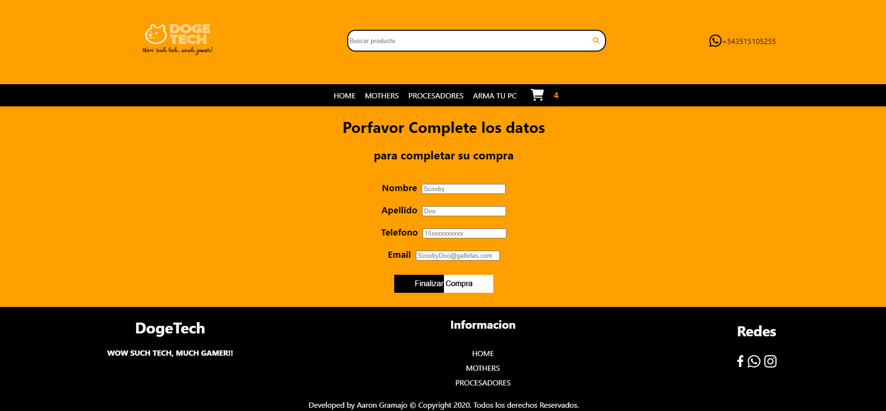

# **Proyecto Ecommerce React** 
# *Curso de React dictado por Coderhouse*
### **Aaron Gramajo**
### **Contacto:**

[](https://https://www.linkedin.com/in/aaron-gramajo-066418239/)
[](https://github.com/AaronGramajo)

# *Info:*

Este es el proyecto final del curso dictado por [CoderHouse](https://www.coderhouse.com) de React Js de la carrera Front-End.
Se trata sobre un Ecommerce, el cual está creado con React.
Se implementa React.js con React Router, React Hooks, y Firebase.

Ademas los productos al realizar la compra se descuentan del stock almacenado en Firebase, actualizandose en tiempo real segun la cantidad vendida.

Dependencias que use : FontAwesome (React-Fontawesome, fontawesome svg core, free-brands-svg-icons, free-regular-svg-icons, free-solid-svg-icons), firebase, react dom, react-router-dom, y React (Hooks (useState, useContext, ect..)).

## *Version Final:*
Link a Netlify del proyecto: 
- [](https://dogetech.netlify.app/)


**Capturas de pantalla:**

### 1. Home:
## 

### 2. Detalle del producto seleccionado:

## 

### 3. Carrito de compras, con productos seleccionados:

## 

### 4. Formulario para realizar la compra:

## 
### 5. Compra finalizada con éxito:

## 

**Gif de como funciona:**
## 

# Para poder usar el proyecto

### Seguir los siguientes pasos:

- Clonar el repositorio de GitHub:

  ```bash
  git clone https://github.com/AaronGramajo/React-Ecommerce.git
  ```

- cd dentro del directorio de la carpeta:
  ```bash
  cd proyecto_ecommerce_
  ```

- Instala las dependencias.
  ```bash
  npm install
  ```

- Para correr el proyecto:

  ```bash
  npm start
  ```